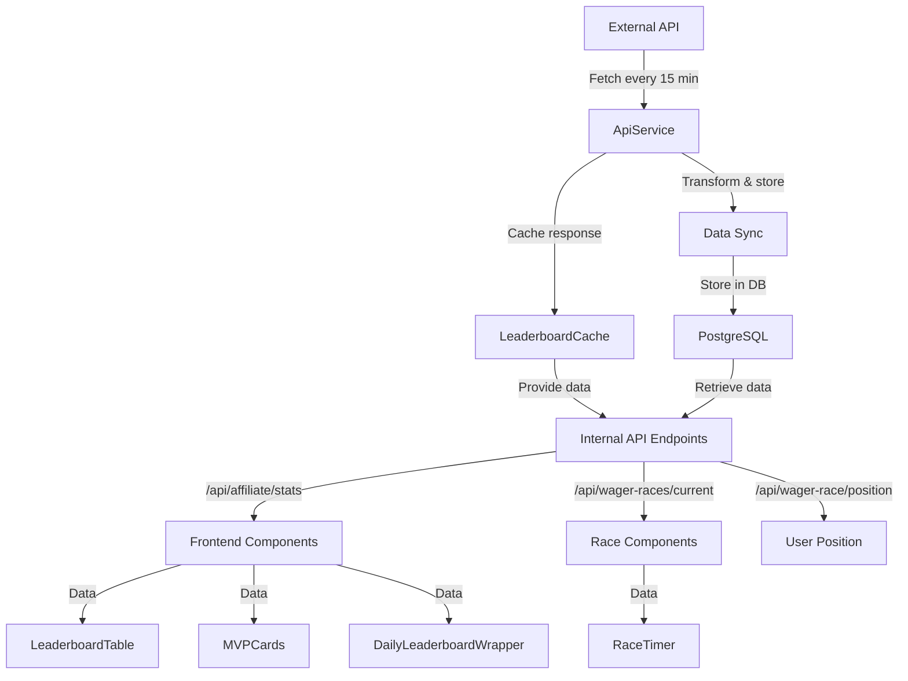

# GoatedVIPs.gg API Integration Guide

This document provides a comprehensive overview of how the GoatedVIPs.gg platform integrates with the Goated.com API, processes data, and serves it to various frontend components.

## 1. API Integration Overview

### 1.1 External API Integration
- **Primary Endpoint**: https://api.goated.com/user2/affiliate/referral-leaderboard/2RW440E
- **Authentication**: JWT Bearer token (managed in API_CONFIG as goatedToken)
- **Purpose**: Fetch affiliate wager data for users with referral codes VIPBOOST/GOATEDVIPS
- **Refresh Interval**: Every 15 minutes (optimized to reduce API load)

### 1.2 API Response Format
The Goated.com API returns data in this structure:
```json
{
  "status": "success",
  "metadata": {
    "totalUsers": 50,
    "lastUpdated": "2024-01-26T20:11:49.000Z"
  },
  "data": {
    "today": {
      "data": [
        {
          "uid": "QBbCmlNl63xCjX3S7OZL",
          "name": "Yels789",
          "wagered": {
            "today": 0,
            "this_week": 15000,
            "this_month": 45000,
            "all_time": 120000
          }
        }
        // More users...
      ]
    },
    "weekly": { "data": [...] },
    "monthly": { "data": [...] },
    "all_time": { "data": [...] }
  }
}
```

## 2. Data Flow Architecture



## 3. Frontend Components & Data Requirements

### 3.1 Leaderboard Components

#### LeaderboardTable.tsx
- **Endpoint**: `/api/affiliate/stats`
- **Required Data Structure**:
```typescript
interface LeaderboardEntry {
  uid: string;
  name: string;
  wagered: {
    today: number;
    this_week: number;
    this_month: number;
    all_time: number;
  };
}
```
- **Features**:
  - Sorting by wagered amount
  - Pagination (10 items per page)
  - Search functionality
  - Tier badges based on all_time wagered amount

#### DailyLeaderboardWrapper.tsx
- **Endpoint**: `/api/affiliate/stats` (filtered for today)
- **Purpose**: Home page daily leaderboard display
- **Data Requirements**: Same as LeaderboardTable but filtered for today's data

### 3.2 MVP Cards
- **Endpoint**: `/api/affiliate/stats`
- **Purpose**: Display top performers for each time period
- **Data Requirements**:
  - First-ranked user from each time period (daily, weekly, monthly)
  - Each MVP needs:
    - uid
    - name
    - wagered amount for respective period
    - all_time wagered for tier calculation
- **Features**:
  - Real-time wager change indicators
  - Tier badges
  - Detailed stats in modal view

### 3.3 Race Components

#### RaceTimer.tsx
- **Endpoint**: `/api/wager-races/current`
- **Required Data Structure**:
```typescript
interface RaceData {
  id: string;
  status: "live" | "ended" | "upcoming";
  startDate: string;
  endDate: string;
  prizePool: number;
  title: string;
  participants: {
    uid: string;
    name: string;
    wager: number;
    position: number;
  }[];
}
```
- **Features**:
  - Live countdown timer
  - Top 10 participants display
  - Real-time position updates
  - Prize pool information

#### WagerRacePosition
- **Endpoint**: `/api/wager-race/position`
- **Required Data Structure**:
```typescript
interface PositionData {
  position: number;
  totalParticipants: number;
  wagerAmount: number;
  previousPosition: number;
  raceType: string;
  raceTitle: string;
  endDate: string;
}
```

## 4. Database Schema & Storage Strategy

### 4.1 Database Tables

#### affiliateStats
```sql
CREATE TABLE affiliate_stats (
  id SERIAL PRIMARY KEY,
  uid VARCHAR(255) NOT NULL,
  name VARCHAR(255) NOT NULL,
  wagered DECIMAL(18,2) NOT NULL,
  period VARCHAR(50) NOT NULL, -- 'today', 'weekly', 'monthly', 'all_time'
  created_at TIMESTAMP NOT NULL DEFAULT NOW(),
  updated_at TIMESTAMP NOT NULL DEFAULT NOW()
);
```

#### wagerRaces
```sql
CREATE TABLE wager_races (
  id VARCHAR(10) PRIMARY KEY, -- YYYYMM format
  status VARCHAR(20) NOT NULL DEFAULT 'live',
  start_date TIMESTAMP NOT NULL,
  end_date TIMESTAMP NOT NULL,
  prize_pool DECIMAL(10,2) NOT NULL DEFAULT 500,
  created_at TIMESTAMP NOT NULL DEFAULT NOW(),
  updated_at TIMESTAMP NOT NULL DEFAULT NOW()
);
```

#### wagerRaceParticipants
```sql
CREATE TABLE wager_race_participants (
  id SERIAL PRIMARY KEY,
  race_id VARCHAR(10) NOT NULL REFERENCES wager_races(id),
  uid VARCHAR(255) NOT NULL,
  name VARCHAR(255) NOT NULL,
  wagered DECIMAL(18,2) NOT NULL,
  position INTEGER NOT NULL,
  created_at TIMESTAMP NOT NULL DEFAULT NOW(),
  updated_at TIMESTAMP NOT NULL DEFAULT NOW()
);
```

### 4.2 Data Synchronization Process
1. API data is fetched every 15 minutes
2. Data is processed for all time periods
3. Database updates are performed in batches of 50 entries
4. Only real data is stored - no synthetic or fallback data
5. Historical data is preserved for tracking purposes

## 5. Authentication & Security

### 5.1 API Authentication
- JWT token management in API_CONFIG
- Token validation before each request
- Error handling for authentication failures

### 5.2 Internal API Security
- Public access for leaderboard and race endpoints
- Rate limiting configuration:
  - Leaderboard: 60 requests per minute
  - Race data: 30 requests per minute

## 6. Error Handling & Recovery

### 6.1 API Failure Handling
1. When API is unavailable:
   - Use most recent real data from database
   - Log failure and attempt to reconnect
   - No synthetic data generation

2. Rate Limit Handling:
   - Respect API rate limits
   - Queue requests when approaching limits
   - Use cached data while waiting for fresh data

### 6.2 Data Integrity
- Validate all API responses before processing
- Ensure data consistency across time periods
- Maintain audit trail of data updates

## 7. Optimization Recommendations

### 7.1 Critical Improvements
1. Token Management:
   - Implement token refresh mechanism
   - Add token validation before requests
   - Monitor token expiration

2. Database Optimization:
   - Add indexes for frequently queried fields
   - Implement query caching
   - Optimize batch processing

3. API Resilience:
   - Implement retry mechanism with exponential backoff
   - Add circuit breaker for API protection
   - Improve error logging and monitoring

### 7.2 Future Enhancements
1. Real-time Updates:
   - Implement WebSocket for live leaderboard updates
   - Add real-time race position updates
   - Enhance user experience with live notifications

2. Data Management:
   - Implement historical data archiving
   - Add data compression for older records
   - Optimize storage strategy for long-term scalability

## 8. API Endpoints Reference

### Public Endpoints (No Auth Required)

#### GET /api/affiliate/stats
- Returns leaderboard data for all time periods
- Rate limit: 60 requests/minute
- Cached for 15 minutes

#### GET /api/wager-races/current
- Returns current active race data
- Rate limit: 30 requests/minute
- Updates every 15 minutes

#### GET /api/wager-race/position
- Returns user's current race position
- Rate limit: 30 requests/minute
- Updates every 15 minutes

## 9. Monitoring & Maintenance

### 9.1 Health Checks
- API health monitoring every 5 minutes
- Database connection monitoring
- Cache invalidation monitoring

### 9.2 Performance Metrics
- API response times
- Database query performance
- Cache hit/miss rates
- Error rates and types

## 10. Development Guidelines

### 10.1 Adding New Features
1. Ensure compatibility with existing data structure
2. Maintain real data integrity
3. Follow established error handling patterns
4. Update documentation for new endpoints

### 10.2 Testing Requirements
1. Verify data accuracy across all time periods
2. Test rate limiting functionality
3. Validate error handling
4. Ensure proper fallback to database data when needed

## 11. Contact & Support

For technical issues or questions about this integration:
- Technical Lead: [Contact Information]
- API Support: [Contact Information]
- Documentation Updates: [Contact Information]
