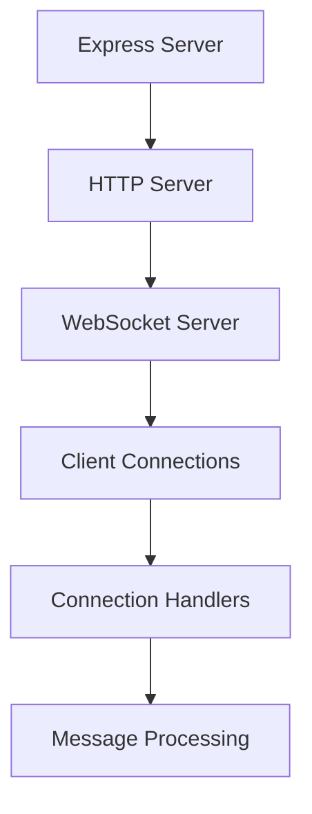

3. **Security Layers**
   - Rate limiting per endpoint category
   - Telegram webhook secret validation
   - Session-based authentication
   - CORS and security headers

### Performance Optimizations
1. **Caching Strategy**
   - In-memory cache for API responses
   - Session store using PostgreSQL
   - Static file caching with proper headers

2. **Load Management**
   - Rate limiting tiers (HIGH/MEDIUM/LOW)
   - WebSocket connection pooling
   - Efficient static file serving

3. **Monitoring & Logging**
   - Structured logging for all API requests
   - WebSocket connection tracking
   - Performance metrics collection
   - Error tracking and reporting

### Deployment Process
1. **Environment Setup**
   ```bash
   # Required environment variables
   NODE_ENV=production
   PORT=5000
   DATABASE_URL=postgresql://...
   SESSION_SECRET=your_secret
   TELEGRAM_BOT_TOKEN=your_bot_token
   TELEGRAM_WEBHOOK_SECRET=your_webhook_secret
   ```

2. **Application Structure**
   ```
   server/
   ├── routes/
   │   ├── challenges.ts
   │   ├── webhook.ts
   │   └── bonus-challenges.ts
   ├── middleware/
   │   └── auth.ts
   ├── index.ts
   └── routes.ts
   ```

3. **Critical Components**
   - Express application setup
   - WebSocket server initialization
   - Telegram bot integration
   - Database connection pool
   - Session management
   - Rate limiting middleware

### Testing & Verification
1. **Health Checks**
   - Database connectivity
   - WebSocket server status
   - Telegram bot initialization
   - Session store availability

2. **Security Verification**
   - Rate limit effectiveness
   - Session cookie security
   - Webhook secret validation
   - CORS policy compliance

3. **Performance Monitoring**
   - Response time tracking
   - WebSocket connection stats
   - Cache hit rates
   - Error rate monitoring


## System Components & Dependencies

### 1. Server Architecture (Priority: High)
- **Main Server (Port 5000)**
  - Express.js REST API
  - WebSocket server for real-time updates
  - Rate limiting middleware
  - PostgreSQL with Drizzle ORM
  
- **Telegram Bot (Port 5001)**
  - Webhook handling
  - User verification
  - Admin commands
  - Real-time notifications

### 2. Real-time Systems

#### WebSocket Implementation
- **Current State**: Partially implemented
- **Issues**:
  - Connection stability in high-load scenarios
  - Reconnection logic needs improvement
  - Missing heartbeat mechanism

#### Required Improvements:
```typescript
// Implement in server/index.ts
const HEARTBEAT_INTERVAL = 30000;
const RECONNECT_TIMEOUT = 5000;

wss.on('connection', (ws) => {
  const heartbeat = setInterval(() => {
    if (ws.readyState === ws.OPEN) {
      ws.ping();
    }
  }, HEARTBEAT_INTERVAL);

  ws.on('close', () => clearInterval(heartbeat));
});
```

## WebSocket Implementation & Testing Strategy

### WebSocket Architecture


### Implementation Components
1. **Server Setup**
   - Express application core
   - HTTP server wrapper
   - WebSocket server integration
   - Session management

2. **Connection Management**
   - Client tracking
   - Heartbeat mechanism
   - Reconnection handling
   - Error recovery

3. **Message Handling**
   - Type-safe message formats
   - Validation middleware
   - Response processing
   - Error boundaries

### Testing Strategy
1. **Unit Testing**
   ```typescript
   // Example: Testing message format validation
   describe('Message Validation', () => {
     it('validates message format', () => {
       const message = {type: 'UPDATE', data: {id: 1}};
       expect(validateMessage(message)).toBeTruthy();
     });
   });
   ```

2. **Integration Testing**
   ```typescript
   // Example: Testing WebSocket connection lifecycle
   describe('WebSocket Lifecycle', () => {
     it('handles connection/disconnection', async () => {
       const ws = new WebSocket(WS_URL);
       // Test connection establishment
       // Test message exchange
       // Test disconnection
     });
   });
   ```

3. **Load Testing**
   ```typescript
   // Example: Testing concurrent connections
   describe('Connection Load', () => {
     it('handles multiple clients', async () => {
       const clients = Array.from({length: 10}, 
         () => new WebSocket(WS_URL));
       // Test concurrent message handling
     });
   });
   ```

### 3. Authentication Flow

#### Current Implementation
- JWT-based authentication
- Telegram verification
- Session management

#### Known Issues
1. Token refresh mechanism incomplete
2. Missing password reset flow
3. Session cleanup not implemented

#### Required Fixes:
1. Implement token refresh endpoint
2. Add password reset flow with email verification
3. Set up session cleanup cron job

### 4. Data Transformation Pipeline

#### Current State
- Basic transformation implemented
- Caching layer missing
- Error handling needs improvement

#### Required Improvements:
1. Add Redis caching layer
2. Implement retry mechanism
3. Add detailed error logging
4. Optimize transformation algorithms

### 5. Admin Dashboard

#### Current Features
- User management
- Race configuration
- System analytics

#### Missing Features
1. Bulk operations for user management
2. Advanced analytics dashboard
3. Audit logging system
4. Performance monitoring tools

## Security Considerations
1. **Webhook Security**
   - Telegram secret token validation
   - Rate limiting for webhook endpoints
   - Request validation middleware

2. **Session Management**
   - Secure cookie configuration
   - PostgreSQL session storage
   - Session cleanup procedures

3. **Access Control**
   - CORS configuration
   - IP-based rate limiting
   - API authentication

### Monitoring & Maintenance
1. **Health Checks**
   - API endpoint monitoring
   - WebSocket connection status
   - Database connectivity
   - Telegram webhook status

2. **Logging**
   - Request logging
   - Error tracking
   - Performance metrics
   - Webhook event logging

3. **Backup Procedures**
   - Database backups
   - Configuration backups
   - Log rotation


## Performance Considerations

### Current Bottlenecks
1. **Database Queries**
   - Missing indexes on frequently accessed columns
   - N+1 query issues in leaderboard
   - Inefficient JOIN operations

2. **API Response Times**
   - Large payload sizes
   - Missing response compression
   - Inefficient data transformation

### Required Optimizations
1. **Database**
```sql
-- Add missing indexes
CREATE INDEX idx_users_telegram_id ON users(telegram_id);
CREATE INDEX idx_wager_races_status ON wager_races(status);
CREATE INDEX idx_transformation_logs_type ON transformation_logs(type);