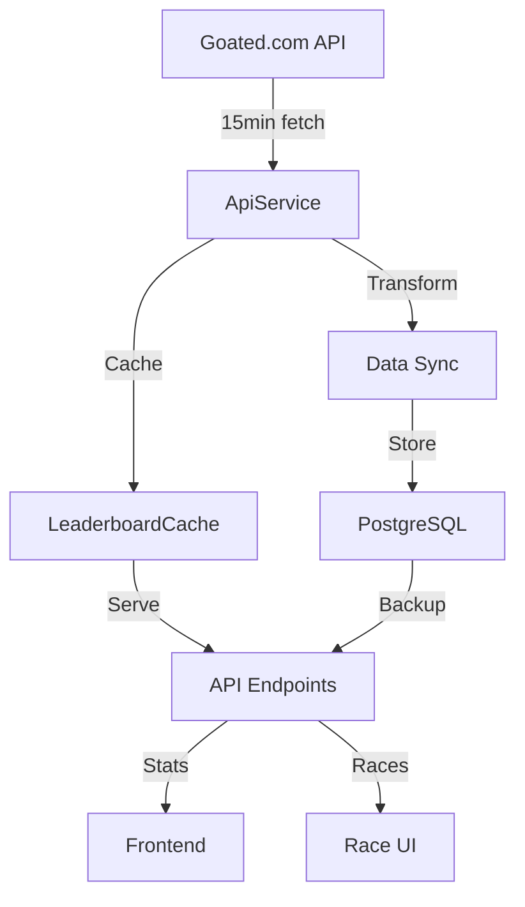

# System Patterns

## API Integration Architecture

### External API Integration (Goated.com)
- **Token Management**: GOATED_TOKEN environment variable for authentication
- **Refresh Interval**: 15-minute synchronized data fetching
- **Caching Strategy**: 15-minute cache with database fallback
- **Error Handling**: Uses database for resilience during API outages

### Data Flow

### Optimization Patterns
1. **Cache Management**
   - In-memory caching for high-frequency data
   - Database persistence for historical data
   - Batch processing (50 entries) for DB updates

2. **Data Transformation**
   - Standardized data structure across system
   - Real-time sorting and filtering
   - Period-based data organization (daily/weekly/monthly/all-time)

3. **Error Resilience**
   - Graceful degradation to database
   - Request queuing for rate limits
   - Exponential backoff for retries

4. **Performance**
   - Optimized refresh intervals
   - Batched database operations
   - Cached API responses

## System Architecture

The GoatedVIPs.gg platform is built with a modular architecture that separates concerns across different layers:

- **Frontend**: A React application written in TypeScript, located in `client/`. It uses Tailwind CSS for styling and Shadcn UI components for a consistent design system.
- **Backend**: An Express.js server in `server/`, also written in TypeScript. It handles API requests, authentication, and business logic.
- **Database**: A PostgreSQL database managed with Drizzle ORM, with schema definitions in `db/schema/`.
- **Telegram Bot**: Implemented using `node-telegram-bot-api`, residing in `server/telegram/`. It provides an alternative interface for users and admins.
- **API Integration**: The platform integrates with the Goated.com API to fetch user wager data.

The system is designed to be scalable, maintainable, and optimized for performance in production environments.

## Key Technical Decisions

- **TypeScript Throughout**: Using TypeScript in both frontend and backend for type safety and better developer experience.
- **Drizzle ORM**: Selected for its lightweight and efficient approach to database interactions.
- **React Query**: Utilized for data fetching and state management on the frontend.
- **Custom Middleware**: Developed custom Express middleware for error handling (`error-handler.ts`), rate limiting (`rate-limiter.ts`), and authentication (`auth.ts`).
- **Account Linking Mechanism**: Implemented a unique three-way account linking system between the platform, Goated.com, and Telegram.
- **Enhanced Database Connection**: Optimized for production with connection pooling, health checks, and graceful shutdowns (`db/connection.ts`).
- **Strategic Database Indexing**: Implemented targeted indexes to optimize query performance for frequently accessed data.
- **Fallback Data Mechanisms**: Created fallback data systems to ensure the application remains functional even when external APIs are unavailable.
- **Graceful Error Handling**: Implemented comprehensive error handling with informative user feedback and automatic recovery mechanisms.

## Design Patterns in Use

- **Model-View-Controller (MVC)**: Applied in the backend to separate data models, views (responses), and controller logic.
- **Singleton Pattern**: Used for the database connection to ensure a single instance is used throughout the application.
- **Observer Pattern**: Implemented with React hooks and context to manage state changes and real-time updates on the frontend.
- **Command Pattern**: Employed in the Telegram bot command structure (`server/telegram/commands/`) to encapsulate request handling.
- **Factory Pattern**: Used in the creation of API clients and services for flexibility and testing.
- **Circuit Breaker Pattern**: Implemented in API interactions to prevent cascading failures when external services are unavailable.
- **Fallback Pattern**: Used to provide alternative data sources when primary sources fail, ensuring application resilience.
- **Cache-Aside Pattern**: Applied in the leaderboard cache to improve performance and reduce API load.
- **Strategy Pattern**: Employed in error handling to dynamically choose the appropriate recovery strategy based on error type.

## Component Relationships

- **Frontend Components**:
  - UI components in `client/src/components/ui/` are reusable across different pages.
  - Custom components like `LeaderboardTable.tsx` and `RaceTimer.tsx` are composed within pages.
  - State is managed globally using React Contexts in `client/src/contexts/` and locally with custom hooks in `client/src/hooks/`.

- **Backend Modules**:
  - Routes defined in `server/routes.ts` map to controllers that interact with the database.
  - Middleware applies cross-cutting concerns like authentication and error handling.
  - The Telegram bot interacts with the same database, ensuring consistency.

- **Database Schemas**:
  - Schemas in `db/schema/` define tables like `users`, `telegramUsers`, and `wagerRaces`.
  - Relationships are established through foreign keys and are managed via Drizzle ORM.
  - Schema definitions are accompanied by Zod validations for data integrity.
  - Strategic indexes are defined in migration files to optimize query performance.
  - Connection pooling is managed centrally in `db/connection.ts` with graceful shutdown handling.

- **API Integration**:
  - External API data is fetched and normalized by utilities in `server/utils/`.
  - Data transformation pipelines ensure consistency before storing in the database.
  - Caching mechanisms in `server/utils/cache.ts` and `server/utils/leaderboard-cache.ts` reduce API load.
  - Fallback data systems provide resilience when external APIs are unavailable.
  - Error handling with recovery strategies ensures application stability.
