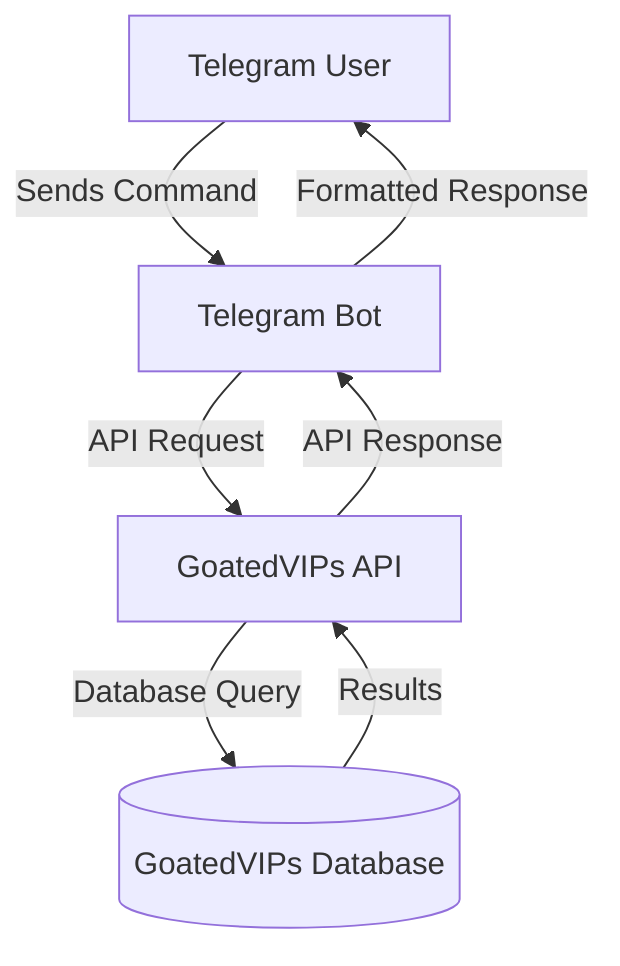

# GoatedVIPs Telegram Bot Implementation Guide

This comprehensive guide outlines the process of creating a standalone Telegram bot for the GoatedVIPs platform. The bot will run on a separate server (Vercel or Replit) and communicate with the main platform through secure API endpoints.

## Table of Contents

1. [Architecture Overview](#architecture-overview)
2. [Prerequisites](#prerequisites)
3. [Setting Up the Bot](#setting-up-the-bot)
4. [Authentication & Security](#authentication--security)
5. [API Endpoints](#api-endpoints)
6. [Database Schema](#database-schema)
7. [Command Implementation](#command-implementation)
8. [Deployment Options](#deployment-options)
9. [Testing & Monitoring](#testing--monitoring)
10. [Advanced Features](#advanced-features)

## Architecture Overview

The Telegram bot will be a standalone service that communicates with the GoatedVIPs platform through secure API endpoints. This architecture provides several benefits:

1. **Scalability**: The bot can scale independently of the main platform.
2. **Resilience**: If the bot crashes, it won't affect the main platform.
3. **Security**: The bot only has access to the endpoints it needs, not the entire database.
4. **Flexibility**: The bot can be deployed on different platforms (Vercel, Replit, etc.).



## Prerequisites

Before you begin, make sure you have:

1. **Telegram Bot Token**: Create a new bot through BotFather on Telegram.
2. **API Key**: Generate an API key from the GoatedVIPs admin panel.
3. **Node.js**: Version 16+ is recommended.
4. **Development Environment**: Set up on Vercel or Replit.

## Setting Up the Bot

### 1. Create a New Project

```bash
# Create a new directory for your bot
mkdir goatedvips-telegram-bot
cd goatedvips-telegram-bot

# Initialize a new Node.js project
npm init -y

# Install required dependencies
npm install telegraf dotenv axios node-cache express
npm install --save-dev typescript @types/node ts-node nodemon
```

### 2. Configure TypeScript

Create a `tsconfig.json` file:

```json
{
  "compilerOptions": {
    "target": "ES2020",
    "module": "NodeNext",
    "moduleResolution": "NodeNext",
    "esModuleInterop": true,
    "strict": true,
    "outDir": "dist",
    "sourceMap": true,
    "resolveJsonModule": true
  },
  "include": ["src/**/*"],
  "exclude": ["node_modules"]
}
```

### 3. Set Up Environment Variables

Create a `.env` file:

```
# Telegram Bot Token
TELEGRAM_BOT_TOKEN=your_telegram_bot_token

# GoatedVIPs API
API_URL=https://goatedvips.gg/api
API_KEY=your_api_key
API_SECRET=your_api_secret

# Admin Telegram IDs (comma-separated)
ADMIN_TELEGRAM_IDS=123456789,987654321

# Optional: Webhook URL (for production)
WEBHOOK_URL=https://your-bot-url.vercel.app/webhook

# Optional: AI Integration (if implemented)
OPENAI_API_KEY=your_openai_api_key
```

### 4. Create the Basic Bot Structure

Create the following directory structure:

```
src/
├── index.ts              # Main entry point
├── bot.ts                # Bot initialization
├── commands/             # Command handlers
│   ├── index.ts          # Command registry
│   ├── start.ts          # Start command
│   ├── verify.ts         # Verification command
│   ├── stats.ts          # Stats command
│   └── ...               # Other commands
├── middleware/           # Bot middleware
│   ├── auth.ts           # Authentication middleware
│   └── rate-limit.ts     # Rate limiting
├── api/                  # API client
│   ├── client.ts         # API client setup
│   ├── auth.ts           # API authentication
│   └── endpoints.ts      # API endpoint definitions
├── utils/                # Utility functions
│   ├── formatting.ts     # Message formatting
│   └── cache.ts          # Caching utilities
└── types/                # TypeScript type definitions
    └── index.ts          # Type definitions
```

## Authentication & Security

### 1. API Authentication

The bot will authenticate with the GoatedVIPs API using an API key and secret. The API key is sent in the request header, and the secret is used to sign the request.

```typescript
// src/api/auth.ts
import crypto from 'crypto';

export function generateSignature(
  method: string,
  path: string,
  timestamp: string,
  nonce: string,
  body: string,
  secret: string
): string {
  const message = `${method}${path}${timestamp}${nonce}${body}`;
  return crypto.createHmac('sha256', secret).update(message).digest('hex');
}

export function generateAuthHeaders(
  method: string,
  path: string,
  body: string = ''
): Record<string, string> {
  const apiKey = process.env.API_KEY || '';
  const apiSecret = process.env.API_SECRET || '';
  const timestamp = Math.floor(Date.now() / 1000).toString();
  const nonce = crypto.randomBytes(16).toString('hex');
  const signature = generateSignature(
    method,
    path,
    timestamp,
    nonce,
    body,
    apiSecret
  );

  return {
    'x-api-key': apiKey,
    'x-timestamp': timestamp,
    'x-nonce': nonce,
    'x-signature': signature,
  };
}
```

### 2. User Authentication

Users will need to verify their Telegram account with their GoatedVIPs account. This is done through a verification process:

1. User sends `/verify username` to the bot
2. Bot creates a verification request in the database
3. Admin approves or rejects the verification request
4. If approved, the user can access their account details through the bot

```typescript
// src/commands/verify.ts
import { Context } from 'telegraf';
import { api } from '../api/client';

export async function verifyCommand(ctx: Context) {
  if (!('text' in ctx.message)) {
    return ctx.reply('Please provide your GoatedVIPs username: /verify username');
  }

  const args = ctx.message.text.split(' ');
  if (args.length !== 2) {
    return ctx.reply('Please provide your GoatedVIPs username: /verify username');
  }

  const username = args[1];
  const telegramId = ctx.from.id.toString();
  const telegramUsername = ctx.from.username || '';

  try {
    const response = await api.post('/telegram/verify', {
      telegramId,
      telegramUsername,
      goatedUsername: username,
    });

    if (response.data.success) {
      return ctx.reply(
        '✅ Verification request submitted! An admin will review your request shortly.'
      );
    } else {
      return ctx.reply(
        `❌ Verification failed: ${response.data.error}`
      );
    }
  } catch (error) {
    console.error('Verification error:', error);
    return ctx.reply(
      '❌ An error occurred while processing your verification request. Please try again later.'
    );
  }
}
```

## API Endpoints

The GoatedVIPs platform provides the following API endpoints for the Telegram bot:

### User Verification

- `POST /api/telegram/verify`: Create a verification request
- `GET /api/telegram/user/:telegramId`: Get user information by Telegram ID

### Stats and Leaderboard

- `GET /api/telegram/stats/:username`: Get user stats
- `GET /api/telegram/leaderboard`: Get leaderboard data
- `GET /api/telegram/race/position/:username`: Get user's position in the current race

### Admin Operations

- `GET /api/telegram/verification-requests`: Get pending verification requests
- `POST /api/telegram/verification-requests/:requestId/approve`: Approve a verification request
- `POST /api/telegram/verification-requests/:requestId/reject`: Reject a verification request
- `POST /api/telegram/broadcast`: Broadcast a message to all users

## Database Schema

The GoatedVIPs platform has the following database schema for Telegram integration:

### API Keys Table

```sql
CREATE TABLE api_keys (
  id SERIAL PRIMARY KEY,
  name TEXT NOT NULL,
  key TEXT NOT NULL UNIQUE,
  secret TEXT NOT NULL,
  permissions JSONB DEFAULT '{}',
  ip_whitelist TEXT,
  created_at TIMESTAMP DEFAULT CURRENT_TIMESTAMP,
  expires_at TIMESTAMP,
  last_used_at TIMESTAMP,
  created_by INTEGER REFERENCES users(id),
  is_active BOOLEAN DEFAULT TRUE,
  rate_limit INTEGER DEFAULT 100,
  metadata JSONB DEFAULT '{}'
);
```

### Telegram Users Table

```sql
CREATE TABLE telegram_users (
  telegram_id TEXT PRIMARY KEY,
  telegram_username TEXT,
  goated_username TEXT NOT NULL,
  is_verified BOOLEAN DEFAULT FALSE,
  verified_at TIMESTAMP,
  verified_by TEXT,
  created_at TIMESTAMP DEFAULT CURRENT_TIMESTAMP,
  updated_at TIMESTAMP
);
```

### Verification Requests Table

```sql
CREATE TABLE verification_requests (
  id SERIAL PRIMARY KEY,
  telegram_id TEXT NOT NULL,
  telegram_username TEXT,
  goated_username TEXT NOT NULL,
  requested_at TIMESTAMP DEFAULT CURRENT_TIMESTAMP,
  status TEXT DEFAULT 'pending',
  admin_notes TEXT,
  verified_at TIMESTAMP,
  verified_by TEXT,
  updated_at TIMESTAMP
);
```

## Command Implementation

### 1. Basic Commands

```typescript
// src/commands/start.ts
import { Context } from 'telegraf';

export async function startCommand(ctx: Context) {
  return ctx.reply(`
🐐 Welcome to Goated Stats Bot!

I'm your degenerate data dealer. Use the commands below to flex your stats, enter challenges, or just vibe.

Don't forget to /verify your Goated username first!

Commands:
• /start – 🚀 Start using the bot  
• /verify – 🔐 Link your Goated account  
• /stats – 📊 Wager stats  
• /race – 🏁 Race position  
• /leaderboard – 🏆 Monthly top players  
• /play – 🎮 Play on Goated  
• /website – 🌐 Visit GoatedVIPs.gg  
• /help – ❓ Help & Info  
  `);
}
```

### 2. Stats Command

```typescript
// src/commands/stats.ts
import { Context } from 'telegraf';
import { api } from '../api/client';
import { formatCurrency } from '../utils/formatting';
import { getUserFromContext } from '../middleware/auth';

export async function statsCommand(ctx: Context) {
  const user = await getUserFromContext(ctx);
  
  if (!user || !user.isVerified) {
    return ctx.reply(
      '❌ You need to verify your account first. Use /verify username to link your Goated account.'
    );
  }

  try {
    const response = await api.get(`/telegram/stats/${user.goatedUsername}`);
    
    if (!response.data.success) {
      return ctx.reply(`❌ Error: ${response.data.error}`);
    }
    
    const stats = response.data.data;
    
    return ctx.reply(`
📊 Stats for ${stats.username}

💰 Wagered:
• Today: ${formatCurrency(stats.stats.daily)}
• This Week: ${formatCurrency(stats.stats.weekly)}
• This Month: ${formatCurrency(stats.stats.monthly)}
• All Time: ${formatCurrency(stats.stats.allTime)}

🏆 Current Rank:
• Daily: ${stats.rank.daily || 'N/A'}
• Weekly: ${stats.rank.weekly || 'N/A'}
• Monthly: ${stats.rank.monthly || 'N/A'}

Use /race to check your position in the current wager race!
    `);
  } catch (error) {
    console.error('Stats error:', error);
    return ctx.reply(
      '❌ An error occurred while fetching your stats. Please try again later.'
    );
  }
}
```

### 3. Leaderboard Command

```typescript
// src/commands/leaderboard.ts
import { Context } from 'telegraf';
import { api } from '../api/client';
import { formatCurrency } from '../utils/formatting';

export async function leaderboardCommand(ctx: Context) {
  try {
    const response = await api.get('/telegram/leaderboard?type=monthly&limit=10');
    
    if (!response.data.success) {
      return ctx.reply(`❌ Error: ${response.data.error}`);
    }
    
    const leaderboard = response.data.data;
    
    let message = `🏆 Monthly Wager Race Leaderboard\n\n`;
    
    leaderboard.entries.forEach((entry, index) => {
      const medal = index === 0 ? '🥇' : index === 1 ? '🥈' : index === 2 ? '🥉' : `${index + 1}.`;
      message += `${medal} ${entry.username}: ${formatCurrency(entry.amount)}\n`;
    });
    
    message += `\nUpdated: ${new Date(leaderboard.timestamp).toLocaleString()}`;
    
    return ctx.reply(message);
  } catch (error) {
    console.error('Leaderboard error:', error);
    return ctx.reply(
      '❌ An error occurred while fetching the leaderboard. Please try again later.'
    );
  }
}
```

### 4. Admin Commands

```typescript
// src/commands/admin/pending.ts
import { Context } from 'telegraf';
import { api } from '../../api/client';
import { isAdmin } from '../../middleware/auth';
import { Markup } from 'telegraf';

export async function pendingCommand(ctx: Context) {
  if (!isAdmin(ctx)) {
    return ctx.reply('❌ This command is only available to admins.');
  }

  try {
    const response = await api.get('/telegram/verification-requests');
    
    if (!response.data.success) {
      return ctx.reply(`❌ Error: ${response.data.error}`);
    }
    
    const requests = response.data.data.requests;
    
    if (requests.length === 0) {
      return ctx.reply('✅ No pending verification requests.');
    }
    
    for (const request of requests) {
      const message = `
📝 Verification Request #${request.id}

👤 Telegram: ${request.telegramUsername ? '@' + request.telegramUsername : 'No username'} (ID: ${request.telegramId})
🎮 Goated Username: ${request.goatedUsername}
⏰ Requested: ${new Date(request.requestedAt).toLocaleString()}
      `;
      
      await ctx.reply(
        message,
        Markup.inlineKeyboard([
          [
            Markup.button.callback('✅ Approve', `approve_${request.id}`),
            Markup.button.callback('❌ Reject', `reject_${request.id}`)
          ]
        ])
      );
    }
  } catch (error) {
    console.error('Pending requests error:', error);
    return ctx.reply(
      '❌ An error occurred while fetching pending requests. Please try again later.'
    );
  }
}
```

## Deployment Options

### 1. Vercel Deployment

Vercel is a great option for deploying the Telegram bot due to its serverless architecture and ease of use.

1. **Create a Vercel Project**:

```bash
# Install Vercel CLI
npm install -g vercel

# Login to Vercel
vercel login

# Deploy the project
vercel
```

2. **Configure Environment Variables**:

Add all the environment variables from your `.env` file to the Vercel project settings.

3. **Configure Webhook**:

```typescript
// src/index.ts
import { Telegraf } from 'telegraf';
import express from 'express';
import { bot } from './bot';

const app = express();
app.use(express.json());

// Webhook endpoint
app.post('/webhook', (req, res) => {
  bot.handleUpdate(req.body, res);
});

// Health check endpoint
app.get('/health', (_req, res) => {
  res.status(200).send('OK');
});

// Start the server
if (process.env.NODE_ENV === 'production') {
  // Set webhook in production
  bot.telegram.setWebhook(process.env.WEBHOOK_URL);
  
  // Start Express server
  const PORT = process.env.PORT || 3000;
  app.listen(PORT, () => {
    console.log(`Server running on port ${PORT}`);
  });
} else {
  // Use polling in development
  bot.launch();
}
```

4. **Create a `vercel.json` File**:

```json
{
  "version": 2,
  "builds": [
    {
      "src": "dist/index.js",
      "use": "@vercel/node"
    }
  ],
  "routes": [
    {
      "src": "/(.*)",
      "dest": "dist/index.js"
    }
  ]
}
```

### 2. Replit Deployment

Replit is another great option for deploying the Telegram bot, especially for quick prototyping and testing.

1. **Create a New Repl**:

Create a new Node.js repl on Replit.

2. **Configure Environment Variables**:

Add all the environment variables from your `.env` file to the Replit Secrets.

3. **Configure the Bot**:

```typescript
// index.js
const { Telegraf } = require('telegraf');
const express = require('express');

const bot = new Telegraf(process.env.TELEGRAM_BOT_TOKEN);

// Add commands here
bot.start((ctx) => ctx.reply('Welcome to GoatedVIPs Bot!'));

// Create Express server for keeping the bot alive
const app = express();
const PORT = process.env.PORT || 3000;

app.get('/', (_req, res) => {
  res.send('Bot is running!');
});

app.listen(PORT, () => {
  console.log(`Server running on port ${PORT}`);
});

// Start the bot
bot.launch();
```

4. **Add a `replit.nix` File**:

```nix
{ pkgs }: {
  deps = [
    pkgs.nodejs-16_x
    pkgs.nodePackages.typescript
    pkgs.yarn
    pkgs.replitPackages.jest
  ];
}
```

5. **Add a Keep-Alive Service**:

To prevent your Replit from going to sleep, you can use a service like UptimeRobot to ping your Replit URL every few minutes.

## Testing & Monitoring

### 1. Testing the Bot

Before deploying the bot to production, it's important to test it thoroughly:

1. **Unit Tests**: Write unit tests for your command handlers and API client.
2. **Integration Tests**: Test the bot's interaction with the GoatedVIPs API.
3. **Manual Testing**: Test the bot manually by sending commands and checking the responses.

### 2. Monitoring

Once the bot is deployed, you should monitor its performance and usage:

1. **Error Logging**: Log all errors to a service like Sentry or Logtail.
2. **Usage Metrics**: Track command usage and API calls to identify bottlenecks.
3. **Uptime Monitoring**: Use a service like UptimeRobot to monitor the bot's uptime.

## Advanced Features

### 1. AI Integration

You can enhance the bot with AI capabilities using OpenAI's API:

```typescript
// src/utils/ai.ts
import { Configuration, OpenAIApi } from 'openai';

const configuration = new Configuration({
  apiKey: process.env.OPENAI_API_KEY,
});

const openai = new OpenAIApi(configuration);

export async function generateResponse(
  prompt: string,
  context: string = ''
): Promise<string> {
  try {
    const response = await openai.createCompletion({
      model: 'gpt-3.5-turbo-instruct',
      prompt: `${context}\n\nUser: ${prompt}\n\nBot:`,
      max_tokens: 150,
      temperature: 0.7,
    });

    return response.data.choices[0].text.trim();
  } catch (error) {
    console.error('AI error:', error);
    return 'Sorry, I encountered an error while generating a response.';
  }
}
```

### 2. Inline Buttons

You can enhance the bot's UI with inline buttons:

```typescript
// src/commands/race.ts
import { Context } from 'telegraf';
import { api } from '../api/client';
import { formatCurrency } from '../utils/formatting';
import { getUserFromContext } from '../middleware/auth';
import { Markup } from 'telegraf';

export async function raceCommand(ctx: Context) {
  const user = await getUserFromContext(ctx);
  
  if (!user || !user.isVerified) {
    return ctx.reply(
      '❌ You need to verify your account first. Use /verify username to link your Goated account.'
    );
  }

  try {
    const response = await api.get(`/telegram/race/position/${user.goatedUsername}`);
    
    if (!response.data.success) {
      return ctx.reply(`❌ Error: ${response.data.error}`);
    }
    
    const raceData = response.data.data;
    
    let message = `
🏁 Wager Race Position for ${raceData.username}

🏆 Current Position: #${raceData.position}
💰 Amount Wagered: ${formatCurrency(raceData.amount)}
⏱️ Race Ends: ${new Date(raceData.raceInfo.endTime).toLocaleString()}
💵 Prize Pool: ${formatCurrency(raceData.raceInfo.totalPrize)}
    `;
    
    if (raceData.nextPosition) {
      message += `\n🔼 Next Position: #${raceData.nextPosition.position} (${raceData.nextPosition.username})`;
      message += `\n🔍 Difference: ${formatCurrency(raceData.nextPosition.difference)}`;
    }
    
    return ctx.reply(
      message,
      Markup.inlineKeyboard([
        [
          Markup.button.url('🎮 Play Now', 'https://goatedvips.gg/play'),
          Markup.button.callback('🔄 Refresh', 'refresh_race')
        ],
        [
          Markup.button.callback('📊 Leaderboard', 'show_leaderboard')
        ]
      ])
    );
  } catch (error) {
    console.error('Race position error:', error);
    return ctx.reply(
      '❌ An error occurred while fetching your race position. Please try again later.'
    );
  }
}
```

### 3. Scheduled Messages

You can send scheduled messages using a cron job:

```typescript
// src/utils/scheduler.ts
import cron from 'node-cron';
import { bot } from '../bot';
import { api } from '../api/client';

// Send daily wager race updates
export function scheduleDailyUpdates() {
  // Run every day at 12:00 PM
  cron.schedule('0 12 * * *', async () => {
    try {
      // Get top 5 users from leaderboard
      const response = await api.get('/telegram/leaderboard?type=monthly&limit=5');
      
      if (!response.data.success) {
        console.error('Failed to fetch leaderboard:', response.data.error);
        return;
      }
      
      const leaderboard = response.data.data;
      
      let message = `📊 Daily Wager Race Update\n\n`;
      
      leaderboard.entries.forEach((entry, index) => {
        const medal = index === 0 ? '🥇' : index === 1 ? '🥈' : index === 2 ? '🥉' : `${index + 1}.`;
        message += `${medal} ${entry.username}: ${formatCurrency(entry.amount)}\n`;
      });
      
      // Get all verified users
      const usersResponse = await api.get('/telegram/verified-users');
      
      if (!usersResponse.data.success) {
        console.error('Failed to fetch verified users:', usersResponse.data.error);
        return;
      }
      
      const users = usersResponse.data.data;
      
      // Send message to all verified users
      for (const user of users) {
        try {
          await bot.telegram.sendMessage(user.telegramId, message);
        } catch (error) {
          console.error(`Failed to send message to user ${user.telegramId}:`, error);
        }
      }
    } catch (error) {
      console.error('Scheduled update error:', error);
    }
  });
}
```

## Conclusion

This guide provides a comprehensive overview of how to create a standalone Telegram bot for the GoatedVIPs platform. By following these instructions, you can create a bot that allows users to access their account details, wager stats, leaderboard positions, and participate in challenges directly from Telegram.

Remember to test the bot thoroughly before deploying it to production, and to monitor its performance and usage after deployment. With proper implementation, the Telegram bot can be a valuable addition to the GoatedVIPs platform, providing users with a convenient way to interact with the platform from Telegram.
